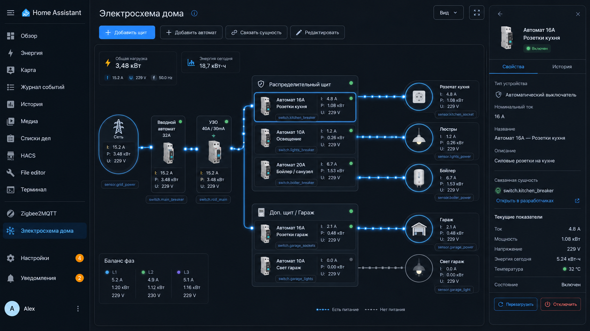
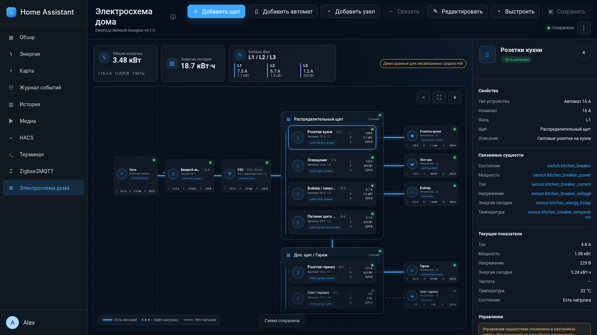

# Electrical Network Designer для Home Assistant

Полноэкранная панель Home Assistant для построения и мониторинга структурной схемы электросети дома: ввод, счётчик, вводной автомат, УЗО/дифавтомат, распределительные щиты, групповые автоматы, розетки и конечные потребители.

## Внешний вид

Концептуальный референс:



Фактический рендер текущей версии панели в браузерном smoke-тесте:



## Что уже реализовано

- отдельная страница в боковом меню Home Assistant;
- редактор схемы с перетаскиванием, масштабированием и перемещением холста;
- узлы: ввод, счётчик, автомат, УЗО/дифавтомат, распределительный щит, потребитель и соединительная точка;
- вложенные распределительные щиты и автоматы, размещённые внутри щита;
- направленные соединения с выбором точки входа и выхода;
- анимированные точки потока на линиях с реальной нагрузкой;
- индикация «есть питание», «идёт нагрузка», «отключено» и «недоступно»;
- привязка Home Assistant entities к состоянию, мощности, току, напряжению, энергии, частоте и температуре;
- общая мощность, энергия за день и приблизительный баланс фаз L1/L2/L3;
- просмотр More Info для связанной сущности;
- опциональное включение и отключение `switch`, `light`, `fan` и `input_boolean` прямо из панели;
- автоматическое выравнивание схемы;
- экспорт и импорт JSON;
- постоянное хранение схемы в `.storage` Home Assistant;
- защита от перезаписи более новой версии схемы из другой вкладки;
- режим только для просмотра у пользователей без прав администратора;
- русская и английская локализация мастера установки.

## Важное ограничение

Панель является средством визуализации и мониторинга. Она не рассчитывает токи короткого замыкания, селективность защит, сечение кабеля, падение напряжения, заземление и соответствие электротехническим нормам. Не используйте её как замену однолинейному проекту или проверке квалифицированным электриком.

Управление сущностями отключено по умолчанию. Перед каждой командой включения или отключения панель запрашивает подтверждение.

## Совместимость

Заявленная минимальная версия: Home Assistant 2025.12.0. Панель написана как custom integration с отдельной страницей в боковом меню и не требует Lovelace resource, Node.js-сборки или внешних JavaScript-библиотек во время работы.

## Статус проверки

Перед сборкой архива выполнены:

- компиляция Python-файлов;
- синтаксическая проверка JavaScript через `node --check`;
- `16` модульных и проектных тестов;
- браузерный smoke-тест с имитацией объекта Home Assistant `hass`;
- проверка отображения `16` узлов и `15` связей, анимации потока, редактирования, импорта, авторазмещения, единиц измерения и отключённой вышестоящей ветки.

Ограничение проверки: в среде сборки не был запущен полноценный экземпляр Home Assistant. Поэтому после установки на реальную систему нужно проверить загрузку панели, WebSocket API и привязку ваших сущностей.

## Установка вручную

1. Откройте каталог конфигурации Home Assistant.
2. Скопируйте папку:

   ```text
   custom_components/electrical_network
   ```

   в:

   ```text
   /config/custom_components/electrical_network
   ```

3. Полностью перезапустите Home Assistant.
4. Откройте **Настройки → Устройства и службы → Добавить интеграцию**.
5. Найдите **Electrical Network Designer** или **Электросхема дома**.
6. Подтвердите название, иконку и URL страницы.
7. В боковом меню появится пункт **Электросхема дома**.

Если интеграция не появилась в поиске, очистите кэш браузера и проверьте журнал Home Assistant на ошибки загрузки custom component.

## Установка через HACS

Архив уже содержит `hacs.json`, но для установки через HACS проект должен находиться в GitHub-репозитории. После публикации репозитория добавьте его в HACS как **Custom repository → Integration**, затем установите интеграцию и перезапустите Home Assistant.

## Первый запуск

При первой установке открывается готовая демонстрационная схема:

```text
Сеть → Вводной автомат → УЗО → Основной щит
                                  ├─ Автомат кухни → Розетка кухни
                                  ├─ Автомат света → Освещение
                                  ├─ Автомат бойлера → Бойлер
                                  └─ Автомат линии гаража → Щит гаража
                                                              ├─ Розетки
                                                              └─ Свет
```

Демонстрационные значения видны только у узлов, у которых нет доступных сущностей Home Assistant. Отключить их можно в **⋮ → Настройки схемы → Использовать демо-значения**.

## Как собрать собственную схему

1. Нажмите **Редактировать**.
2. Добавьте ввод, счётчик, автоматы, УЗО, щиты и потребители.
3. Перетащите узлы на нужные позиции.
4. Для элементов внутри щита выберите этот щит в поле **Расположение**.
5. Нажмите **Связать**, затем последовательно выберите исходный и конечный узел.
6. В правой панели задайте название, номинал, фазу и MDI-иконку.
7. Свяжите сущности Home Assistant.
8. Нажмите **Сохранить** или дождитесь автоматического сохранения.

Панель запрещает направленные циклы, дублирующиеся линии, неизвестные узлы и размещение элемента внутри объекта, который не является щитом.

## Привязка сущностей

У каждого узла доступны следующие поля:

| Поле | Ожидаемая сущность | Назначение |
|---|---|---|
| Состояние | `switch.*`, `light.*`, `binary_sensor.*` и другие | Включён или отключён узел |
| Мощность | `sensor.*` | Текущая активная мощность |
| Ток | `sensor.*` | Текущий ток |
| Напряжение | `sensor.*` | Текущее напряжение |
| Энергия | `sensor.*` | Энергия за выбранный период, обычно за день |
| Частота | `sensor.*` | Частота сети |
| Температура | `sensor.*` | Температура автомата, реле или потребителя |

Примеры:

```text
switch.kitchen_breaker
sensor.kitchen_breaker_power
sensor.kitchen_breaker_current
sensor.kitchen_breaker_voltage
sensor.kitchen_energy_today
sensor.kitchen_breaker_temperature
```

Для линии можно отдельно привязать сущность состояния и мощности. Это полезно, когда сама отходящая линия измеряется отдельным реле или счётчиком.

### Единицы измерения

Панель приводит распространённые единицы к внутреннему формату:

- мощность — Вт;
- ток — А;
- напряжение — В;
- энергия — кВт·ч;
- частота — Гц;
- температура — °C.

Если у сущности отсутствует `unit_of_measurement`, значение трактуется как уже приведённое к указанной выше единице.

## Логика потока

Линия подсвечивается, когда:

1. исходный узел получает питание по всей цепочке от ввода;
2. узел и линия не находятся в состоянии `off`/`unavailable`;
3. мощность линии или её дочерней ветки превышает заданный порог.

Порог задаётся в настройках схемы. По умолчанию он равен `3 W`, чтобы не анимировать ветви с шумом измерения.

## Управление нагрузкой

Управление включается в настройках схемы. Команды доступны только для доменов:

```text
switch
light
fan
input_boolean
```

Команда отправляется стандартным вызовом `turn_on` или `turn_off`. Используйте эту возможность только для сущностей, безопасных для удалённого управления.

## Клавиши

| Комбинация | Действие |
|---|---|
| `Ctrl/Cmd + S` | Сохранить |
| `Ctrl/Cmd + D` | Дублировать выбранный узел |
| `Delete` / `Backspace` | Удалить выбранный узел или линию в режиме редактирования |
| `Esc` | Закрыть окно, режим связывания или инспектор |
| Колесо мыши | Масштабирование относительно курсора |

## Импорт и экспорт

Экспорт создаёт JSON с настройками, координатами, узлами, связями и entity ID. Секреты и токены Home Assistant в файл не попадают.

Перед импортом выполняется клиентская проверка, а при сохранении — повторная серверная валидация. Импорт не перезаписывает серверную схему до нажатия **Сохранить**.

Пример готового файла находится в `examples/demo_diagram.json`.

## Хранение и резервное копирование

Документ хранится Home Assistant Store под ключом:

```text
.storage/electrical_network.<config_entry_id>
```

Не редактируйте файл вручную при запущенном Home Assistant. Для переноса схемы используйте экспорт JSON или стандартную резервную копию Home Assistant.

## Права доступа

- читать схему могут все пользователи, которым доступна панель;
- сохранять, импортировать, сбрасывать и редактировать схему может только администратор;
- сервер повторно проверяет права независимо от состояния кнопок во фронтенде;
- при параллельном редактировании используется номер ревизии: устаревшая вкладка не может молча затереть более свежую схему.

## Структура проекта

```text
custom_components/electrical_network/
├── __init__.py                 # регистрация панели и статических файлов
├── config_flow.py              # UI-установка и параметры бокового меню
├── const.py
├── defaults.py                 # демонстрационная схема
├── frontend/
│   └── electrical-network-panel.js
├── manifest.json
├── schema.py                   # строгая валидация документа
├── store.py                    # постоянное хранилище и ревизии
├── websocket_api.py            # get/save/reset API
├── strings.json
└── translations/
    ├── en.json
    └── ru.json
```

## Проверки для разработчика

```bash
python -m compileall -q custom_components/electrical_network
node --check custom_components/electrical_network/frontend/electrical-network-panel.js
pytest -q
bash scripts/run_browser_smoke.sh
```

Браузерный smoke-test запускает панель с имитацией объекта `hass`, проверяет загрузку схемы, построение линий, редактирование, импорт, единицы измерения и логику отключённой вышестоящей ветки.

## Текущая версия

`0.1.0` — функциональный MVP: редактор, серверное хранение, привязка сущностей, мониторинг и опциональное управление нагрузкой.
